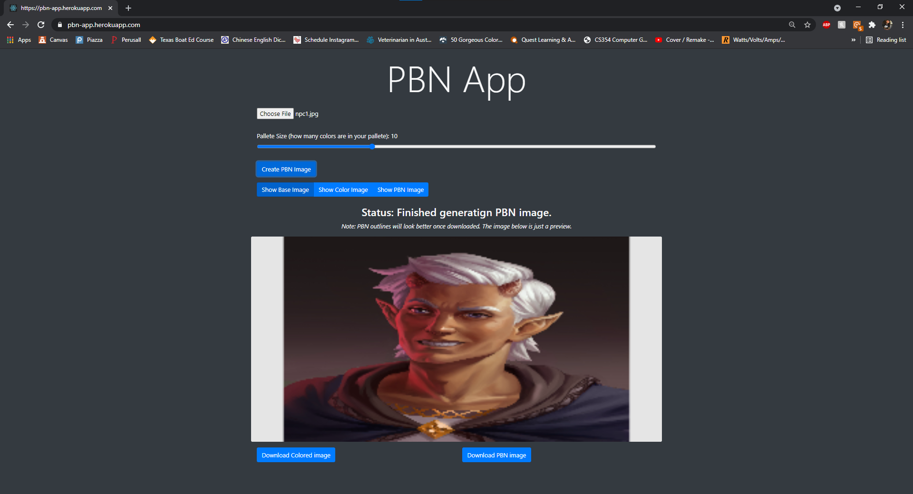
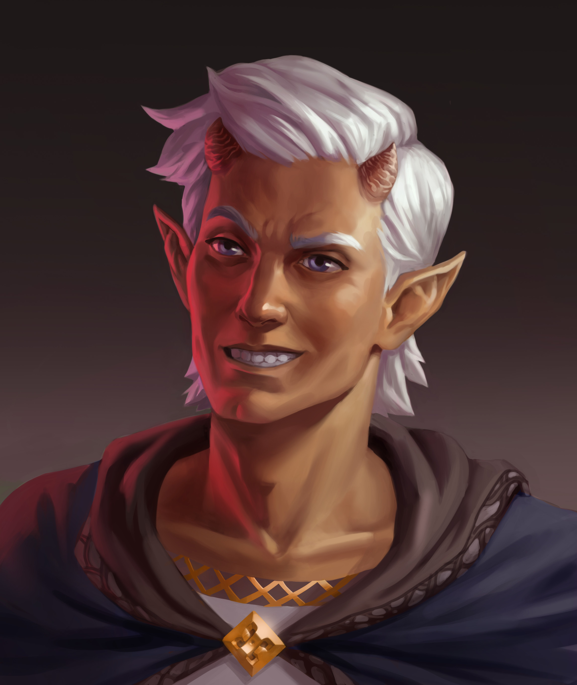
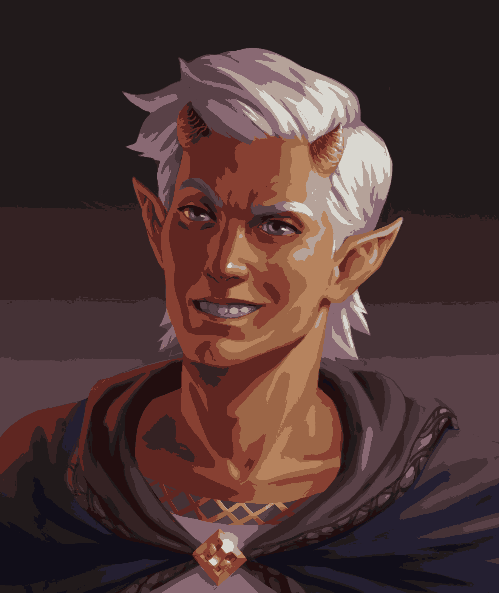
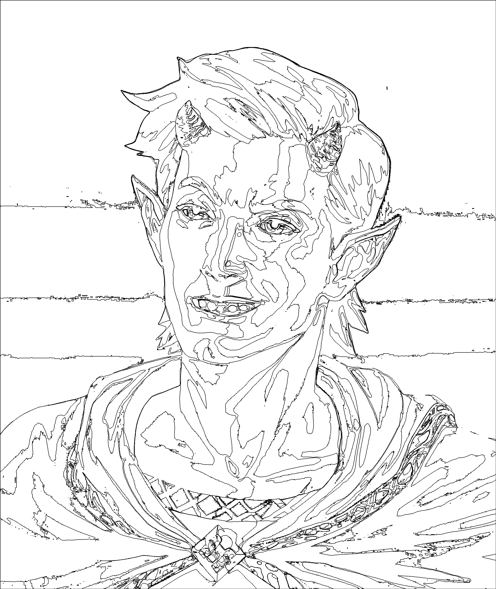

# PBN App
The following app was made as a final project for CS354 - Computer Graphics. The goal of the project was to create a web-app that allowed users to upload images and create Paint by Numbers outlines from them. A deployed instance of the project can be seen at https://pbn-app.herokuapp.com/ (**note**: if the website is taking a bit to initially show up, DONT WORRY! This is normal, and I believe it just has to do with heroku putting the app to sleep when it is not getting a lot of traffic).  
A full project report can be seen below, in the [Project Report](#project-report) section.

## Build Information
To build this on your machine locally, all you need is `npm`. From there, you can simply run the following commands:
```
$> npm install
$> npm start
```
Additional information about the toolchain used to setup the project can be seen below.

## Getting Started with Create React App

This project was bootstrapped with [Create React App](https://github.com/facebook/create-react-app).  
The following information was all auto-generated as part of using Create React App.

### Available Scripts

In the project directory, you can run:

#### `npm start`

Runs the app in the development mode.\
Open [http://localhost:3000](http://localhost:3000) to view it in the browser.

The page will reload if you make edits.\
You will also see any lint errors in the console.

#### `npm test`

Launches the test runner in the interactive watch mode.\
See the section about [running tests](https://facebook.github.io/create-react-app/docs/running-tests) for more information.

#### `npm run build`

Builds the app for production to the `build` folder.\
It correctly bundles React in production mode and optimizes the build for the best performance.

The build is minified and the filenames include the hashes.\
Your app is ready to be deployed!

See the section about [deployment](https://facebook.github.io/create-react-app/docs/deployment) for more information.

# Project Report
## Contents
*  [Tools Used](#tools-used)
*  [Project Breakdown](#project-breakdown)
*  [Shortcomings](#shortcomings)
*  [Takeaways](#takeaways)
*  [Screenshots](#screenshots)

## Tools Used
For this project I decided I wanted to use `React` to build out the web-app, since I have used `React` for other school projects and personal projects, and am comfortable using it. Additionally, for some basic responsive frontend styling, I decided to also use `Bootstrap`, since it makes creating a gool-looking front-end bearable. The project utilized `WebGL` to display previews of the image, and the library `gl-matrix` was used to create vectors and matrices for `WebGL`. `Jimp` was used to handle parsing incoming images and accessing their pixel values, `node-kmeans` was used to run the k-means algorithm for picking colors, and `image-encode` was used to encode the resulting image as a PNG for downloading. Finally, `heroku` was used to deploy the project for free.

## Project Breakdown
This section of the report aims to breakdown the various things occurring throughout the project, and highlight important Classes and functions. This section will start with the user uploading an image and walk through the project step-by-step until we reach the downloaded image.
1. ### Rendering Components
   **Functions:** `App.tsx:App`, `PBN.tsx:PBN.Render`  
   This step is really just an explaination for if you have never seen React Before. The `App` function returns the body of our web-app, which includes a title and our `PBN` component. By placing it in the body of our App, we construct a `PBN` object, and run it's `Render` function, which describes what to show for that component, and also constructs and shows any other sub-components, including the image upload button, color palette slider, and WebGL canvas.
2. ### Parsing image into a Picture Class
   **Functions:** `imageLoader.tsx:ImageLoader.changeFunc`, `PBN.tsx:PBN.imageUploadCallbackFactory`, `Picture.tsx:Picture.fromJimp`  
   This step begins when someone finishes clicking through the file selection window. Once the file is read, it is passed to `Jimp`, which creates a `Jimp` object that can read and write the pixles. This `Jimp` object is passed to the image callback function, whose behavior can be seen in the `imageUploadCallbackFactory`. This Creates a new `Picture` object by reading the width, heigh, and pixel data of the `Jimp` object, and stores it in the `baseImage` member of the PBN Class. This will allow the base image to be accessed from other functions in the PBN class. Once the base image is loaded, it will also be displayed in the WebGL canvas.
3. ### Generating Color Palette
   **Functions:** `PBN.tsx:PBN.kickoffGeneration`, `PBN.tsx:PBN.kmeansCallbackFactory`  
   This step kicks-off the entire process of generating the PBN image. Before the kickoff function is called, the `palleteSize` (yes, it's improperly spelled because I cannot spell, but I will likely fix it sometime later when I fix up this project.) is set using using some admittedly janky functional programming and callbacks from the `PalleteSize` component (the slider). When the `Generate PBN` button is pressed, the `kickoffGeneration` function will pass the base image color data, the palette size, and the kMeans callback function the the `kmeans.clusterize` function. This will start the kMean clustering algortihm on our color data, and when it is complete, call the function returned by the `kmeansCallbackFactory`. In this callback function, we will read off our centroids from the result, and store them in our color palette. This will then also kick-off the generation of the colored-in image.
4. ### Generating Colored Image
   **Functions:** `PBN.tsx:PBN.generateColoredImage`  
   This is probably the most basic step in the process, the function will first set the `coloredImage` member equal to the base image. Then for each pixel in the image, it will get it's distance to each color in the color palette. It will then set the color of that pixel equal to the color it is closest to. Finally, it will call the function to create the actual PBN Image.
5. ### Generating PBN Image
   **Functions:** `PBN.tsx:PBN.generatePBNImage`, `PBN.tsx:PBN.findOutline`  
   For this step, we will visit each pixel, and if it has not yet been visited we will find it's region and mark each pixel in it's region as visited. While getting a region, we will store all the pixels inside the region, as well as the outline of the region. The first step is to create an empty 2d array of boolean values, all set to false, to represent which pixels we have visited. Then, for reach pixel in the image, we will call `findOutline` to get it's region.  
   In the `findOutline` function, if the pixel has been visited before, it returns null. If the pixel has not been visited, it will place that point in a queue, and then start working through the queue. For each item it pops from the queue, it sets that pixel to visited, and adds it to the points in the result. Then, for each pixel left, right, above, and below it, if that pixel is equal to the color of the pixel we started at, they are in the same region and therefore get added to the queue. If any of the neighboring pixels are of a different color, then we know the pixel we are at lies on an edge, so we also add it to the list of points that make up the outline of the region.  
   When the queue has been fully processed, the region is returned to the `generatePBNImage` function, and the process is repeated for each pixel. When it is complete, a new Picture object is created with the width and height of the colored image. This picture is then filled white, then, for each point in the outline of every region, that point is set to black, creating our PBN outline.
6. ### Downloading Images
   **Functions:** `PBN.tsx:PBN.generateDownloadLinks`  
   This step occurs when the download button is pressed, and each download button is only available to be pressed when the associated picture exists. Once clicked, the `generateDownloadLinks` function will determine which image you are downloading, and then create a new buffer with the image encoded as a png. the `encode` function comes from our `image-encode` library. The buffer is then used to create a blob, and a object url is generated using the blob. A new anchor element (`<a></a>`) is temporarily created with the url to the download, and is added to the body. A mouse click is simulated to click on the link, causing the file to be downloaded, and then the anchor element is removed.

The following segments of code may also be of interest:
* ### WebGL Code
   **Functions:** `PBNRenderer.tsx:PBN.initCanvas`, `PBNRenderer.tsx:PBN.setTexture`, `PBNRenderer.tsx:PBN.RedrawCanvas`  
   All these function help to setup and render our images in the WebGL Canvas context. Most of these steps mirror how they would work in OpenGL, but some aspects are slightly different. `initGLCanvas` does exactly that, it initializes matrices, creates and binds buffers, sets up, compiles, and links shader programs, and draws the canvas. However, rather than constantly redrawing the canvas in a loop, it is simply left as it's own function, to be called whenever the image we are previewing changes. When we want to preview changes, the `setTexture` function is called, which creates a texture from the Picture object we pass it, and sets the aspect ratio transformation matrix accordingly.  
   The shaders for this project are both quite simple. The vertex shader for our image plane simply takes in the points in the plane, translates them based on the aspect ratio, then translates using the view and projection matrices. The fragment shader simply takes the UV calculated in the vertex shader, and plugs it into the texture to get the fragment color.

## Shortcomings
I encountered many more issues in this project than I had initially expected, however, I am still really impressed with the results. The largest thing that is missing from this project is the numbering system. The only reason this was not able to be implemented is because I wasn't able to figure out a good way to write the numbers into the image. Figuring out which regions should be what color is easy, and finding the location to place the number in the image isn't too har either, since we have all the points in the region that the number belongs to, but I couldn't figure out a good way to write the number onto the image.  
The second big issue with the project right now is the quality of the preview. Though we are always working with the full resolution of the image, the WebGL window for some reason shows the preview of each image in lower quality. This can become an issue in larger images where the outlines are much thinner compared to the whole image, and therefore don't show up well in the preview. I tried looking into the issue, but had to leave it as is to make more progress on the rest of the project. Another workaround idea I had was to implement zoom and pan controls on the preview to allow users to see the sections more clearly, but again did not have time to implement it before the project deadline.

## Takeaways
This project has been absolutely eye opening to me, and I am now inspired to do more WebGL projects. Additionally, I feel like this project has been a nice introduction for me to the image-processing side of graphics. I also got to learn about the k-means algorithm, and though I did not re-implement it, knowing how it works will allow me to find use cases for it in the future.  
One big regret I have with this project is in how I structed a lot of the code. A lot of react websites are written using functional components, but components can also be written as classes. Shortly into writing the PBN Component, I realized it would be better represented as a class than a functional component, and changing it allowed me to better manage values and data. I feel like I should have just done this with all the components, so that it would be easier to handle their data, and I wouldn't have to pass information through callbacks as much. In future projects I do with WebGL I will experiment more with using class components to try and find a good layout that suits me and my development process.

## Screenshots
*Test image is one that I found on google and am using for a home D&D Campaign. Its size is about 2.3K x 2.5k px.*
### App Preview

### Base Image

### Colored Image (Downloaded)

### PBN Image (Downloaded)

